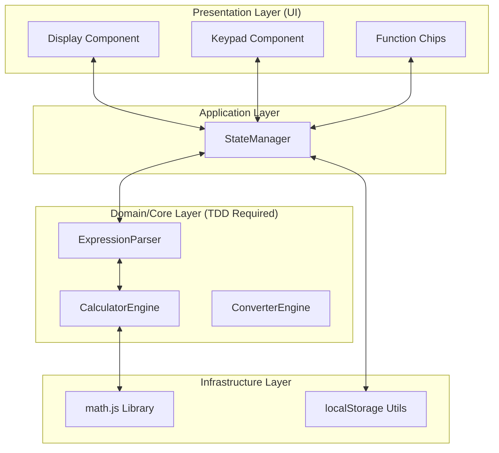

# 🧪 Engineering Calculator: Pro (TDD & SOLID)

> **소프트웨어 엔지니어링 원칙과 품질의 정수를 담은 현대적인 공학용 계산기**

[](https://1916571-alt.github.io/cal_demo/)
[](https://vitejs.dev/)
[](https://vitest.dev/)
[](https://tailwindcss.com/)
[](https://opensource.org/licenses/MIT)

---

## 🌟 프로젝트 개요 (Project Overview)

본 프로젝트는 단순한 계산기 구현을 넘어, **신뢰성 있는 소프트웨어 아키텍처**와 **엄격한 품질 관리 시스템**을 구축하는 데 초점을 맞춘 공학용 계산기 웹 애플리케이션입니다.

대학생 개발자로서 실무 수준의 **테스트 주도 개발(TDD)**과 **SOLID 객체 지향 원칙**을 실제 프로젝트에 적용하여, 유지보수가 용이하고 확장성이 뛰어난 엔지니어링 소프트웨어를 설계하는 역량을 증명하고자 제작되었습니다.

🔗 **[라이브 데모 바로가기](https://1916571-alt.github.io/cal_demo/)**

---

## 🚀 엔지니어링 우수성 (Engineering Excellence)

### 1. 🧪 Test-Driven Development (TDD)
모든 코어 로직(수식 파서, 엔진, 상태 관리)은 **테스트 코드가 구현 코드보다 먼저 작성**되었습니다.
- **Red-Green-Refactor** 사이클을 엄격히 준수하여 결함 발생률을 최소화했습니다.
- **90% 이상의 테스트 커버리지**를 목표로 하며, 복잡한 수식 예외 처리를 완벽하게 검증합니다.

### 2. 깔끔한 객체 지향 설계 (SOLID)
- **SRP (단일 책임)**: 파싱, 계산, 상태 관리를 독립적인 모듈로 분리하여 코드의 응집도를 높였습니다.
- **OCP (개방-폐쇄)**: 새로운 수학 함수나 단위 변환 카테고리를 기존 코드 수정 없이 확장할 수 있는 구조를 설계했습니다.
- **DIP (의존성 역전)**: 상위 모듈이 하위 모듈에 직접 의존하지 않도록 의존성을 주입하여 테스트 용이성을 확보했습니다.

### 3. 고도화된 수식 처리 시스템
단순한 입력값 전달이 아닌, 고도화된 **자체 수식 파싱 엔진**을 포함합니다.
- **Implicit Multiplication**: `2π`, `5(3+2)`, `2sin(30)`과 같은 암시적 곱셈을 자동으로 처리합니다.
- **Precision Management**: 부동 소수점 오차를 제어하고, 공학적인 정밀도(지수 표기법 등)를 유지합니다.

---

## 🏗️ 시스템 아키텍처 (Architecture)

본 프로젝트는 관심사의 분리(Separation of Concerns)를 실현하기 위해 **계층화된 아키텍처(Layered Architecture)**를 채택했습니다.



### 아키텍처 상세 설명
- **Core Layer**: 순수 비즈니스 로직이 위치하며, 외부 라이브러리(math.js)의 의존성을 캡슐화합니다. Vitest를 통한 TDD가 강제되는 영역입니다.
- **Application Layer**: 앱의 전체 상태를 관리하며, UI 계층과 비즈니스 로직 계층 사이의 중재자 역할을 수행합니다. 내부적으로 불변성(Immutability)을 유지하며 상태를 업데이트합니다.
- **Presentation Layer**: Vanilla JS와 Tailwind CSS를 사용하여 구현되었으며, 로직과 철저히 분리되어 재사용 가능한 컴포넌트 구조를 가집니다.

---

## ✨ 핵심 기능 (Key Features)

### 🔢 강력한 계산 엔진
- **기본 연산**: 사칙 연산 및 괄호 수식 지원
- **고급 함수**: 삼각함수(sin, cos, tan), 로그(log, ln), 제곱근, 거듭제곱
- **상수 지원**: π(Pi), e(Euler's number) 내장
- **각도 모드**: DEG(도) 및 RAD(라디안) 실시간 전환

### 🔄 스마트 단위 변환기
- 길이, 무게, 온도 등 필수 공학 단위 변환 기능
- 실시간 변환 결과 노출 및 단위 스왑 기능

### 🎨 프리미엄 UX/UI
- **모던 아방가르드 디자인**: 고대비 다크 모드와 세련된 타이포그래피(Space Grotesk)
- **부드러운 인터랙션**: 60fps 마이크로 애니메이션 및 트랜지션 효과
- **반응형 레이아웃**: 모바일에서 데스크톱까지 완벽한 적응형 UI

---

## �️ 기술 스택 (Tech Stack)

| 구분 | 기술 | 이유 |
| :--- | :--- | :--- |
| **Framework** | Vanilla JS (ES6+) | 핵심 로직 제어 및 성능 최적화를 위해 라이브러리 없이 구현 |
| **Bundler** | Vite 5.0 | 초고속 개발 환경 및 최적화된 빌드 시스템 확보 |
| **Styling** | Tailwind CSS 3.4 | 유틸리티 퍼스트 방식을 통한 일관성 있는 디자인 시스템 구축 |
| **Testing** | Vitest 1.0 | Vite와 완벽하게 통합된 현대적인 테스트 프레임워크 사용 |
| **Math Engine** | math.js | 안정적인 수식 연산 및 정밀도 보장 |
| **Deployment** | GitHub Actions/Pages | 자동화된 CI/CD 파이프라인 구축 |

---

## 📦 설치 및 실행 방법 (Installation)

```bash
# 레포지토리 클론
git clone https://github.com/1916571-alt/cal_demo.git
cd cal_demo

# 의존성 설치
npm install

# 로컬 개발 서버 실행
npm run dev

# 테스트 실행 (All)
npm test

# TDD 모드 (Watch)
npm run test:watch
```

---

## 📈 품질 관리 지표 (Quality Metrics)

포트폴리오로서 프로젝트의 신뢰성을 보장하기 위해 다음과 같은 지표를 관리합니다.

- **Test Coverage**: Core Logic 90% 이상 (Vitest Coverage 보고서 제공)
- **Linting**: ESLint를 통한 코드 스타일 및 정재된 코딩 컨벤션 준수
- **Performance**: Lighthouse 점수 95점 이상 목표 (TTI, FCP 최적화)

---

## � 연락처 (Contact)

- **GitHub**: [@1916571-alt](https://github.com/1916571-alt)
- **Live Demo**: [https://1916571-alt.github.io/cal_demo/](https://1916571-alt.github.io/cal_demo/)

---
**This project is a testament to disciplined software engineering on the web.** 🚀
